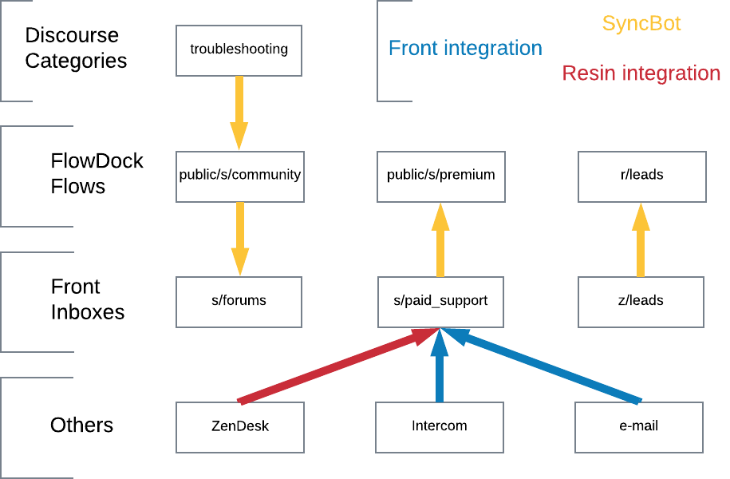

# SyncBot Quick Start

## "Unify the conversation"
A little Bot, using the ProcBot framework, that links communication services.

## What does SyncBot solve?

* Notifications where you want them
	* To solve for the problem of not noticing Front notifications
	* But please, receive notifications somewhere
* Brings Front "pro features" to the forums
	* Monitoring
	* GitHub linked issues
	* Audits
	* Analytics
* Hubot everywhere!

## What does each service bring to the party?

* Front provides a good management of the support queue
	* Good for seeing what needs attention
	* Supports public vs private
	* Its rules make it the place where SLA tags happen
* FlowDock
	* Good for seeing the stream of messages
	* Good for getting pings and giving quick help
* Forums
	* Topics here become web searchable
	* Forums have an auto-suggest when people create new topics
	* In general Resineers shouldn't need to worry too much

## How should my support shift flow?

1) Front shows you the current state of support
	* support/community and support/premium
	* List of what needs attention
	* Reply or comment
	* Snooze, archive or leave open
1) FlowDock shows you the flow of support
	* public/s/forums and public/s/premium
	* Monitor for new messages

* SyncBot provides links between services in the thread for easy navigation
* Some actions are specific to particular services (at the moment!)
	* `Archive` can only be done through Front
	* `Snooze` can only be done through Front
	* `Mark as solution` can only be done through the Forums
	* `Solve` can only be done in ZenDesk

## What goes where?

* A new thread in a source flow will become a new linked thread in a destination flow
* A new message on a linked thread will become a new message in all its linked threads
* If a service does not support privacy, then privacy is assumed by default
* To make a comment public use `#reply`

## How do I set up my accounts?

* Ensure your GitHub, Front, Discourse, FlowDock usernames are mappable.
	* `Hubot, suggest username` will suggest options based on your FlowDock handle.
* Ask Apo (or Gergely) to make you a Discourse moderator

## I love technical details

* [the full readme](syncbot-readme.md)

## Glossary

In general the authors have standardised on FlowDock terminology, where unambiguous.

* `connecting comment` syncbot’s message with the links to the other services
	* it is acknowledged that `connecting whisper` would be more precise, but the authors think it sounds weird
* `whisper` term from forums to describe an internal message
	* because FlowDock uses `comment` for any message
* `reply` term from forums to describe a public message to the user
	* because FlowDock uses `comment` for any message
* `mirror` term to describe the services in a way that acknowledges that they should be duplicating data
* `forums` forums.resin.io, our Discourse instance
* `comment`/`message` analogous terms for a message (be it public or private)
* `service` - term to generically describe Front, FlowDock and Forums
